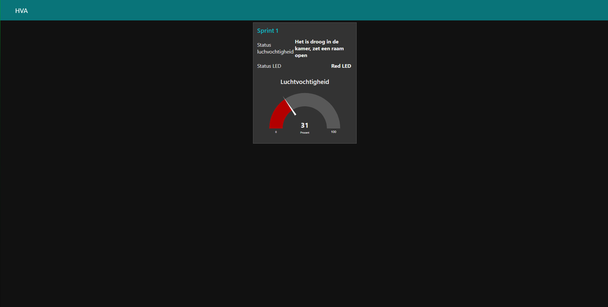
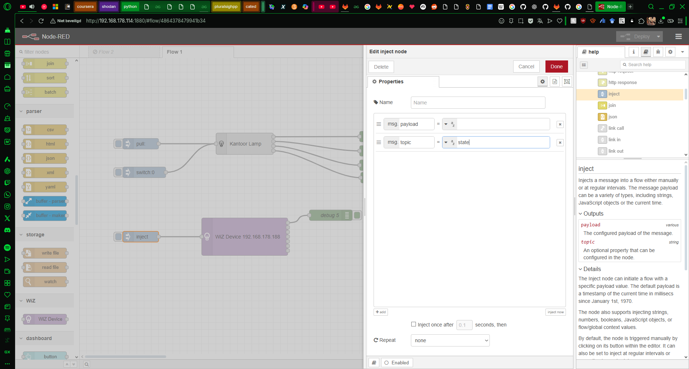
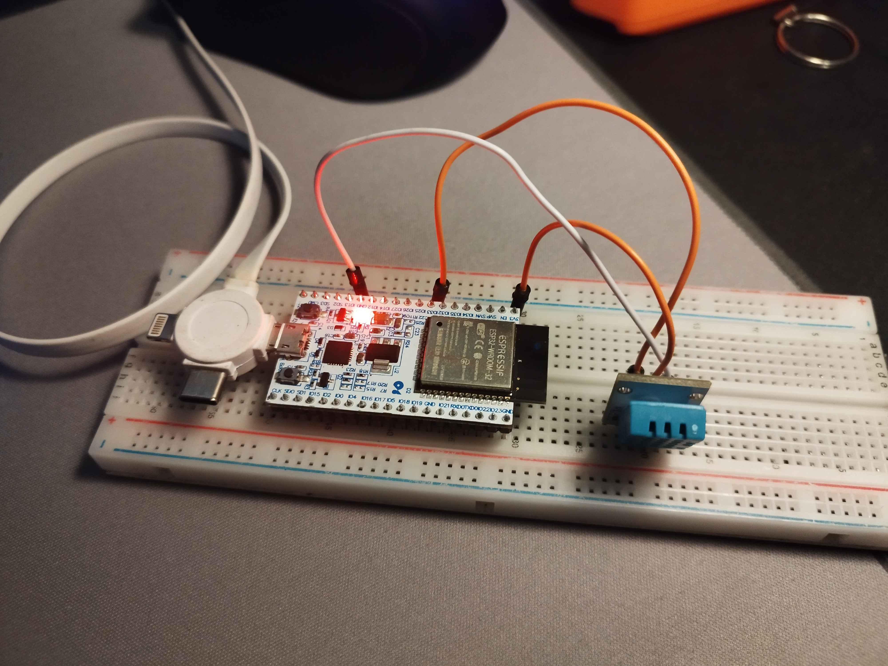

# Technische documentatie sub-project

In deze sprints heb ik een klein project gemaakt wat ervoor zorgt dat ik de luchtvochtigheid in mijn kamer kan meten en op basis van de output een led gaat branden. Om dit te laten werken heb ik gebruik gemaakt van Node-RED. Dit is een programma wat veel integraties bevat en makkelijk in gebruik is. Node-RED heb ik hier gebruikt om de verbinding tussen de Arduino en de Raspberry Pi tot stand te brengen.

## Gebruikte producten

- [ ] Arduino Uno R3 met Standard firmata
- [ ] DHT11(Luchtvochtigheidssensor)
- [ ] 2x LED (Red, Green)
- [ ] 2x resistors 180Ω
- [ ] 11x male to male kabels
- [ ] 32GB SD kaart met Raspian OS
- [ ] Raspberry Pi 4

Iteratie 2

- [ ] Smart Lamp (vervanging voor de LED's)

Iteratie 3

- [ ] ESP32 dev module (vervangt de Arduino UNO)

## Node-RED

In Node-RED wordt alles beheert om ervoor te zorgen dat zowel de juiste LED aangaat als dat het dashboard werkt en de juiste informatie wordt getoond.
Om zowel de Arduino als het dashboard te laten werken, zijn de volgende packages geïnstalleerd:


Hieronder is de flow die is gemaakt om de opdracht te vervullen. de flow gaat als volgt:

1. De data wordt opgehaald van de Arduino
2. Wordt in switch naar de juiste node gestuurd, de andere wordt naar de graadmeter gestuurd met een limit van 1 input per 2 seconden die door wordt gestuurd. dit om het dashboard soepel te laten lijken. de onderste is om de rauwe data in een log op te slaan
3. Aan de hand van de waarde (onder of gelijk aan 40% = Rode LED aan, onder of gelijk aan 60% = groene LED aan, boven de 60% = rode LED aan) wordt het naar de juiste node gestuurd om op het dashboard te laten zien wat de status van de luchtvochtigheid(status luchtvochtigheid) en van de led(Status LED) is.



Hieronder de flow om het zelf ook uit te voeren:

```json
[{"id":"cb04c2a971a28c8f","type":"tab","label":"Flow 2","disabled":false,"info":"","env":[]},{"id":"94405c90ad4204dd","type":"arduino in","z":"cb04c2a971a28c8f","name":"","pin":"5","state":"ANALOG","arduino":"048385f20640044d","x":130,"y":300,"wires":[["82121aa8914b9e65","d91ea386a36b34e7","7481248ef18ebef0"]]},{"id":"d91ea386a36b34e7","type":"file","z":"cb04c2a971a28c8f","name":"","filename":"/home/robka/Downloads/luchvochtigheid.log","filenameType":"str","appendNewline":true,"createDir":false,"overwriteFile":"false","encoding":"none","x":770,"y":480,"wires":[[]]},{"id":"82121aa8914b9e65","type":"switch","z":"cb04c2a971a28c8f","name":"","property":"payload","propertyType":"msg","rules":[{"t":"lte","v":"40","vt":"str"},{"t":"gte","v":"40","vt":"str"},{"t":"gte","v":"60","vt":"str"}],"checkall":"true","repair":false,"outputs":3,"x":350,"y":220,"wires":[["51866ba89bd780de","fcf5a9603f678fa4","8a276fffc202e486","164f470c4bcd85fa"],["b9310469e8c717f2","14837ea1dd4b0d93","eb475f12b4c2e9b3","8cbe4bbc53aec683"],["289fa0350ef747c1","fcf5a9603f678fa4","8a276fffc202e486","164f470c4bcd85fa"]]},{"id":"51866ba89bd780de","type":"change","z":"cb04c2a971a28c8f","name":"too dry","rules":[{"t":"set","p":"payload","pt":"msg","to":"Het is droog in de kamer, zet een raam open","tot":"str"}],"action":"","property":"","from":"","to":"","reg":false,"x":650,"y":120,"wires":[["94d8e58b32fe9bf9"]]},{"id":"b9310469e8c717f2","type":"change","z":"cb04c2a971a28c8f","name":"perfect","rules":[{"t":"set","p":"payload","pt":"msg","to":"De luchtvochtigheid in de kamer is optimaal","tot":"str"}],"action":"","property":"","from":"","to":"","reg":false,"x":650,"y":160,"wires":[["94d8e58b32fe9bf9"]]},{"id":"289fa0350ef747c1","type":"change","z":"cb04c2a971a28c8f","name":"too wet","rules":[{"t":"set","p":"payload","pt":"msg","to":"de kamer is veel te nat, zet een raam open","tot":"str"}],"action":"","property":"","from":"","to":"","reg":false,"x":660,"y":200,"wires":[["94d8e58b32fe9bf9"]]},{"id":"94d8e58b32fe9bf9","type":"ui_text","z":"cb04c2a971a28c8f","group":"099af9fe1f81df1f","order":2,"width":0,"height":0,"name":"","label":"Status luchvochtigheid","format":"{{msg.payload}}","layout":"row-spread","className":"","style":false,"font":"","fontSize":16,"color":"#000000","x":920,"y":160,"wires":[]},{"id":"82ccd81bee9c97ef","type":"arduino out","z":"cb04c2a971a28c8f","name":"green","pin":"10","state":"OUTPUT","arduino":"048385f20640044d","x":870,"y":260,"wires":[]},{"id":"d2ac7fa4ea0a2634","type":"arduino out","z":"cb04c2a971a28c8f","name":"red","pin":"9","state":"OUTPUT","arduino":"048385f20640044d","x":870,"y":60,"wires":[]},{"id":"0ead1cc93b4459c1","type":"ui_gauge","z":"cb04c2a971a28c8f","name":"","group":"099af9fe1f81df1f","order":0,"width":0,"height":0,"gtype":"gage","title":"Luchtvochtigheid","label":"Procent","format":"{{value}}","min":0,"max":"100","colors":["#b30000","#0fe600","#cb3a3a"],"seg1":"40","seg2":"60","diff":false,"className":"","x":910,"y":420,"wires":[]},{"id":"7481248ef18ebef0","type":"delay","z":"cb04c2a971a28c8f","name":"","pauseType":"rate","timeout":"5","timeoutUnits":"seconds","rate":"1","nbRateUnits":"2","rateUnits":"second","randomFirst":"1","randomLast":"5","randomUnits":"seconds","drop":true,"allowrate":false,"outputs":1,"x":680,"y":420,"wires":[["0ead1cc93b4459c1"]]},{"id":"f76b76c683f94ea4","type":"ui_text","z":"cb04c2a971a28c8f","group":"099af9fe1f81df1f","order":2,"width":0,"height":0,"name":"","label":"Status LED","format":"{{msg.payload}}","layout":"row-spread","className":"","style":false,"font":"","fontSize":16,"color":"#000000","x":890,"y":340,"wires":[]},{"id":"14837ea1dd4b0d93","type":"change","z":"cb04c2a971a28c8f","name":"green on dash","rules":[{"t":"set","p":"payload","pt":"msg","to":"Green LED","tot":"str"}],"action":"","property":"","from":"","to":"","reg":false,"x":680,"y":320,"wires":[["f76b76c683f94ea4"]]},{"id":"fcf5a9603f678fa4","type":"change","z":"cb04c2a971a28c8f","name":"red on dash","rules":[{"t":"set","p":"payload","pt":"msg","to":"Red LED","tot":"str"}],"action":"","property":"","from":"","to":"","reg":false,"x":670,"y":360,"wires":[["f76b76c683f94ea4"]]},{"id":"eb475f12b4c2e9b3","type":"change","z":"cb04c2a971a28c8f","name":"on","rules":[{"t":"set","p":"payload","pt":"msg","to":"true","tot":"bool"}],"action":"","property":"","from":"","to":"","reg":false,"x":650,"y":240,"wires":[["82ccd81bee9c97ef"]]},{"id":"8a276fffc202e486","type":"change","z":"cb04c2a971a28c8f","name":"on","rules":[{"t":"set","p":"payload","pt":"msg","to":"true","tot":"bool"}],"action":"","property":"","from":"","to":"","reg":false,"x":650,"y":40,"wires":[["d2ac7fa4ea0a2634"]]},{"id":"8cbe4bbc53aec683","type":"change","z":"cb04c2a971a28c8f","name":"off","rules":[{"t":"set","p":"payload","pt":"msg","to":"false","tot":"bool"}],"action":"","property":"","from":"","to":"","reg":false,"x":650,"y":80,"wires":[["d2ac7fa4ea0a2634"]]},{"id":"164f470c4bcd85fa","type":"change","z":"cb04c2a971a28c8f","name":"off","rules":[{"t":"set","p":"payload","pt":"msg","to":"false","tot":"bool"}],"action":"","property":"","from":"","to":"","reg":false,"x":650,"y":280,"wires":[["82ccd81bee9c97ef"]]},{"id":"048385f20640044d","type":"arduino-board","device":"/dev/ttyACM0"},{"id":"099af9fe1f81df1f","type":"ui_group","name":"Sprint 1","tab":"5e75b1098ebb33e7","order":1,"disp":true,"width":6,"collapse":false,"className":""},{"id":"5e75b1098ebb33e7","type":"ui_tab","name":"HVA","icon":"Sprint 1","disabled":false,"hidden":false}] 

```

## Arduino

De kabels zitten als volgt in de Arduino:

| Poort | Actuator/Sensor | Input/Output |
| ----- | --------------- | ------------ |
| D9    | LED Red         | Output       |
| D10   | LED Green       | Output       |
| A5    | DHT11           | Input        |

Hieronder de foto van dat het echt werkt:


## Arduino setup pin

Voordat alles in elkaar was gezet, had ik het eerst gesimuleerd op een website genaamd Tinkercad, hierin is de DHT11 niet aanwezig, dus is de TMP36 als placeholder geplaatst.

Hieronder de foto van hoe het eruit ziet in de simulatie:

[Arduino setup code](https://www.tinkercad.com/things/dF5luZuq6rS/editel?returnTo=%2Fdashboard%2Fdesigns%2Fcircuits&sharecode=3FQCR9ykaGUuQ90otKsLFxWrucVOyq6voQyNrrw0ibE)

### Code Arduino

Hieronder de code die op de Arduino kan worden gebruikt zonder een Raspberry Pi of Node-RED
om de output data te kunnen bekijken, is `Serial.begin` toegevoegd.

```C++

// GEMAAKT DOOR ROBIN PHADUNGKWAN

#include <Arduino.h>
#include <DHT.h>
#include <DHT_U.h>

#include <dht11.h>
#define DHT11PIN A5

dht11 DHT11;

void setup() // opzet, een keer uitgevoerd
{
  pinMode(9,OUTPUT); //red
  pinMode(10,OUTPUT); //green
  Serial.begin(9600); // serial monitor
}

void loop() // wordt uitgevoerd tot stroomverlies of overschrijding
{
  Serial.println();

  int chk = DHT11.read(DHT11PIN);
  if (DHT11.humidity <= 40){
    digitalWrite(10,HIGH);
    digitalWrite(9,LOW);
  }
  else if(DHT11.humidity >= 60){
    digitalWrite(10,LOW);
    digitalWrite(9,HIGH);
  }
  else{
    digitalWrite(10,LOW);
    digitalWrite(9,HIGH);
  }
  
  Serial.print("Humidity (%): ");
  Serial.println((float)DHT11.humidity, 2);
  delay(2000);
}
```

### Iteratie 2

De LED's zijn vervangen met een smart lamp om meerdere kleuren te laten zien en zo minder draden en weerstanden te gebruiken die op het breadboard komen. Ook heb ik hierbij geleerd om via het netwerk spullen aan te sturen, bij de lamp was dit via UDP(Universal Datagram Protocol).
Dit was een uitdaging doordat het onduidelijk was hoe de lamp zijn informatie toegestuurd wil krijgen, na dit uit te vogelen door te experimenteren in Node-RED kwam ik erachter dat de topic aangeeft aan wat er veranderd moet worden aan de lamp.

Hieruit kwam deze flow:

De lamp veranderd op basis van de sensor naar de kleuren geel(bij te droog),groen(bij perfect) en blauw(bij te nat).

De flow is als volgt:

```json
[{"id":"cb04c2a971a28c8f","type":"tab","label":"project luchtvocht","disabled":false,"info":"","env":[]},{"id":"d91ea386a36b34e7","type":"file","z":"cb04c2a971a28c8f","name":"","filename":"/home/robka/Downloads/luchvochtigheid.log","filenameType":"str","appendNewline":true,"createDir":false,"overwriteFile":"false","encoding":"none","x":790,"y":420,"wires":[[]]},{"id":"82121aa8914b9e65","type":"switch","z":"cb04c2a971a28c8f","name":"","property":"payload","propertyType":"msg","rules":[{"t":"lte","v":"40","vt":"str"},{"t":"gte","v":"40","vt":"str"},{"t":"gte","v":"60","vt":"str"}],"checkall":"true","repair":false,"outputs":3,"x":350,"y":220,"wires":[["51866ba89bd780de"],["b9310469e8c717f2"],["289fa0350ef747c1"]]},{"id":"51866ba89bd780de","type":"change","z":"cb04c2a971a28c8f","name":"too dry","rules":[{"t":"set","p":"payload","pt":"msg","to":"Het is droog in de kamer, zet een raam open","tot":"str"},{"t":"set","p":"topic","pt":"msg","to":"color","tot":"str"}],"action":"","property":"","from":"","to":"","reg":false,"x":650,"y":120,"wires":[["94d8e58b32fe9bf9","1deb3c9bac19e969"]]},{"id":"b9310469e8c717f2","type":"change","z":"cb04c2a971a28c8f","name":"perfect","rules":[{"t":"set","p":"payload","pt":"msg","to":"De luchtvochtigheid in de kamer is optimaal","tot":"str"},{"t":"set","p":"topic","pt":"msg","to":"color","tot":"str"}],"action":"","property":"","from":"","to":"","reg":false,"x":650,"y":160,"wires":[["94d8e58b32fe9bf9","c4861d57b3a46aa4"]]},{"id":"289fa0350ef747c1","type":"change","z":"cb04c2a971a28c8f","name":"too wet","rules":[{"t":"set","p":"payload","pt":"msg","to":"de kamer is veel te nat, zet een raam open","tot":"str"},{"t":"set","p":"topic","pt":"msg","to":"color","tot":"str"}],"action":"","property":"","from":"","to":"","reg":false,"x":660,"y":200,"wires":[["94d8e58b32fe9bf9","673a6bb436b6adf8"]]},{"id":"94d8e58b32fe9bf9","type":"ui_text","z":"cb04c2a971a28c8f","group":"099af9fe1f81df1f","order":2,"width":0,"height":0,"name":"","label":"Status luchvochtigheid","format":"{{msg.payload}}","layout":"row-spread","className":"","style":false,"font":"","fontSize":16,"color":"#000000","x":920,"y":260,"wires":[]},{"id":"0ead1cc93b4459c1","type":"ui_gauge","z":"cb04c2a971a28c8f","name":"","group":"099af9fe1f81df1f","order":0,"width":0,"height":0,"gtype":"gage","title":"Luchtvochtigheid","label":"Procent","format":"{{value}}","min":0,"max":"100","colors":["#b30000","#0fe600","#cb3a3a"],"seg1":"40","seg2":"60","diff":false,"className":"","x":910,"y":360,"wires":[]},{"id":"7481248ef18ebef0","type":"delay","z":"cb04c2a971a28c8f","name":"","pauseType":"rate","timeout":"5","timeoutUnits":"seconds","rate":"1","nbRateUnits":"2","rateUnits":"second","randomFirst":"1","randomLast":"5","randomUnits":"seconds","drop":true,"allowrate":false,"outputs":1,"x":660,"y":360,"wires":[["0ead1cc93b4459c1"]]},{"id":"4319661808567430","type":"wiz-device","z":"cb04c2a971a28c8f","wiz_config":"6d07c225caa08e2c","ip":"192.168.178.188","x":1160,"y":140,"wires":[[],[],[],[],[],[],[]]},{"id":"1deb3c9bac19e969","type":"change","z":"cb04c2a971a28c8f","name":"dry light","rules":[{"t":"set","p":"payload","pt":"msg","to":"{\"r\": 255, \"g\":255 ,\"b\":0}","tot":"json"}],"action":"","property":"","from":"","to":"","reg":false,"x":860,"y":120,"wires":[["4319661808567430"]]},{"id":"673a6bb436b6adf8","type":"change","z":"cb04c2a971a28c8f","name":"wet light","rules":[{"t":"set","p":"payload","pt":"msg","to":"{\"r\": 0, \"g\":0 ,\"b\":255}","tot":"json"}],"action":"","property":"","from":"","to":"","reg":false,"x":860,"y":160,"wires":[["4319661808567430"]]},{"id":"c4861d57b3a46aa4","type":"change","z":"cb04c2a971a28c8f","name":"perfect light","rules":[{"t":"set","p":"payload","pt":"msg","to":"{\"r\": 0, \"g\":255 ,\"b\":0}","tot":"json"}],"action":"","property":"","from":"","to":"","reg":false,"x":870,"y":200,"wires":[["4319661808567430"]]},{"id":"eb7f8b3e72e9616b","type":"arduino in","z":"cb04c2a971a28c8f","name":"","pin":"5","state":"ANALOG","arduino":"048385f20640044d","x":170,"y":260,"wires":[["82121aa8914b9e65","7481248ef18ebef0","d91ea386a36b34e7"]]},{"id":"099af9fe1f81df1f","type":"ui_group","name":"Sprint 1","tab":"5e75b1098ebb33e7","order":1,"disp":true,"width":6,"collapse":false,"className":""},{"id":"6d07c225caa08e2c","type":"wiz-config","name":"","interface":"wlan0"},{"id":"048385f20640044d","type":"arduino-board","device":"/dev/ttyACM0"},{"id":"5e75b1098ebb33e7","type":"ui_tab","name":"HVA","icon":"Sprint 1","disabled":false,"hidden":false}]
```

### Iteratie 3

Voor deze iteratie had ik gekozen om de Arduino om te ruilen voor een ESP32 dev module, vanwege het feit dat dit met WiFi kan werken en ik daardoor gebruik kan maken van MQTT(Message Queuing Telemetry Transport). Om zo data op te sturen naar de Raspberry Pi, waardoor de smart lamp van kleur veranderd.

Maar voordat alles met MQTT gaat werken moesten er een paar dingen gebeuren voordat het gaat werken:

- mosquitto en mosquitto-client installeren op de Raspberry Pi
- driver op de computer installeren

Ik begon met mosquitto te installeren op de Raspberry Pi, dit waren de commando's die ik heb gebruikt om het te installeren:


Daarna heb ik MQTT getest door een inject uit te voeren met als topic `roomTemp` zodat ik zeker wist dat het werkt:


Als laatste ben ik begonnen aan het programmeren van de ESP32 dev module, maar voordat het werkt moest deze driver geïnstalleerd worden: https://www.silabs.com/software-and-tools/usb-to-uart-bridge-vcp-drivers?tab=downloads

Nadat deze geïnstalleerd was en bij Arduino IDE het board ook was toegevoegd maakte ik deze code:

```cpp
// Gemaakt door Robin Phadungkwan

#include <DHT.h> 
#include <DHT_U.h>
#include <WiFi.h>
#include <ESPmDNS.h>
#include <PubSubClient.h>


const char *ssid = "mijn huisnetwerknaam(express weggehaald)";
const char *password = "Wachtwoord(weggehaald)"; 
const char* mqtt_server = "192.168.178.114";
const char* mqtt_topic = "roomTemp";
const char* clientID = "sensor14";


#define DHTPIN 33
#define DHTTYPE DHT11
DHT dht(DHTPIN,DHTTYPE);

WiFiClient wifiClient;
PubSubClient client(wifiClient);

void setup(){
  Serial.begin(9600); 
 
  Serial.print("connecting to ");
  Serial.println(ssid);

  WiFi.begin(ssid,password);

  while (WiFi.status() != WL_CONNECTED) {
    delay(500);
    Serial.print(".");
  }
  Serial.println("wifi verbonden");
  dht.begin();

  client.setServer(mqtt_server,1883);
  client.connect(clientID);
  
  
}
void loop(){
  if (!client.connected()){
    client.connect(clientID);
    Serial.println("to MQTT Broker verbonden");
  }
  float h = dht.readHumidity();
  float t = dht.readTemperature();

  if (isnan(h) || isnan(t)) {
    Serial.println("DHT read failed");
  } else {
    Serial.print("Humidity: ");
    Serial.print(h);
    Serial.print(" %  Temperature: ");
    Serial.print(t);
    Serial.println(" C");

    // publish humidity
    String payload = String(h, 1);
    client.publish(mqtt_topic, payload.c_str());
  }

  delay(2500);  // REQUIRED for DHT11
}
```

De poort is door de vervanging veranderd van A5 naar poort 33 gegaan en zag de hardware er als volgt uit:

Nadat alles wat gedaan was de flow in Node-RED als volgt:
[](./images/flow%20mqtt.png)
En was de flow:

```json
[{"id":"cb04c2a971a28c8f","type":"tab","label":"project luchtvocht","disabled":false,"info":"","env":[]},{"id":"4864378479941b34","type":"tab","label":"testing","disabled":false,"info":"","env":[]},{"id":"048385f20640044d","type":"arduino-board","device":"/dev/ttyACM0"},{"id":"5e75b1098ebb33e7","type":"ui_tab","name":"HVA","icon":"Sprint 1","disabled":false,"hidden":false},{"id":"099af9fe1f81df1f","type":"ui_group","name":"Sprint 1","tab":"5e75b1098ebb33e7","order":1,"disp":true,"width":6,"collapse":false,"className":""},{"id":"5a80b43a04dc2653","type":"ui_base","theme":{"name":"theme-light","lightTheme":{"default":"#0094CE","baseColor":"#0094CE","baseFont":"-apple-system,BlinkMacSystemFont,Segoe UI,Roboto,Oxygen-Sans,Ubuntu,Cantarell,Helvetica Neue,sans-serif","edited":false},"darkTheme":{"default":"#097479","baseColor":"#097479","baseFont":"-apple-system,BlinkMacSystemFont,Segoe UI,Roboto,Oxygen-Sans,Ubuntu,Cantarell,Helvetica Neue,sans-serif","edited":false},"customTheme":{"name":"Untitled Theme 1","default":"#4B7930","baseColor":"#4B7930","baseFont":"-apple-system,BlinkMacSystemFont,Segoe UI,Roboto,Oxygen-Sans,Ubuntu,Cantarell,Helvetica Neue,sans-serif"},"themeState":{"base-color":{"default":"#0094CE","value":"#0094CE","edited":false},"page-titlebar-backgroundColor":{"value":"#0094CE","edited":false},"page-backgroundColor":{"value":"#fafafa","edited":false},"page-sidebar-backgroundColor":{"value":"#ffffff","edited":false},"group-textColor":{"value":"#1bbfff","edited":false},"group-borderColor":{"value":"#ffffff","edited":false},"group-backgroundColor":{"value":"#ffffff","edited":false},"widget-textColor":{"value":"#111111","edited":false},"widget-backgroundColor":{"value":"#0094ce","edited":false},"widget-borderColor":{"value":"#ffffff","edited":false},"base-font":{"value":"-apple-system,BlinkMacSystemFont,Segoe UI,Roboto,Oxygen-Sans,Ubuntu,Cantarell,Helvetica Neue,sans-serif"}},"angularTheme":{"primary":"indigo","accents":"blue","warn":"red","background":"grey","palette":"light"}},"site":{"name":"Node-RED Dashboard","hideToolbar":"false","allowSwipe":"false","lockMenu":"false","allowTempTheme":"true","dateFormat":"DD/MM/YYYY","sizes":{"sx":48,"sy":48,"gx":6,"gy":6,"cx":6,"cy":6,"px":0,"py":0}}},{"id":"1729ceffe5130b3e","type":"smartthings-config","name":"thuis","token":"05ad613b-b252-4365-a51d-b79b7bb4e86c"},{"id":"8d1f136120e3ada3","type":"ui_tab","name":"Testme","icon":"dashboard","disabled":false,"hidden":false},{"id":"964cdbdcb3249390","type":"ui_group","name":"Test","tab":"8d1f136120e3ada3","order":1,"disp":true,"width":"6","collapse":false,"className":""},{"id":"6d07c225caa08e2c","type":"wiz-config","name":"","interface":"wlan0"},{"id":"d5956cf1fafa7724","type":"mqtt-broker","name":"","broker":"192.168.178.115","port":1883,"clientid":"","autoConnect":true,"usetls":false,"protocolVersion":4,"keepalive":60,"cleansession":true,"autoUnsubscribe":true,"birthTopic":"","birthQos":"0","birthRetain":"false","birthPayload":"","birthMsg":{},"closeTopic":"","closeQos":"0","closeRetain":"false","closePayload":"","closeMsg":{},"willTopic":"","willQos":"0","willRetain":"false","willPayload":"","willMsg":{},"userProps":"","sessionExpiry":""},{"id":"b501398d019b2130","type":"mqtt-broker","name":"","broker":"localhost","port":1883,"clientid":"","autoConnect":true,"usetls":false,"protocolVersion":4,"keepalive":60,"cleansession":true,"autoUnsubscribe":true,"birthTopic":"","birthQos":"0","birthRetain":"false","birthPayload":"","birthMsg":{},"closeTopic":"","closeQos":"0","closeRetain":"false","closePayload":"","closeMsg":{},"willTopic":"","willQos":"0","willRetain":"false","willPayload":"","willMsg":{},"userProps":"","sessionExpiry":""},{"id":"d91ea386a36b34e7","type":"file","z":"cb04c2a971a28c8f","name":"","filename":"/home/robka/Downloads/luchvochtigheid.log","filenameType":"str","appendNewline":true,"createDir":false,"overwriteFile":"false","encoding":"none","x":790,"y":420,"wires":[[]]},{"id":"82121aa8914b9e65","type":"switch","z":"cb04c2a971a28c8f","name":"","property":"payload","propertyType":"msg","rules":[{"t":"lte","v":"40","vt":"str"},{"t":"gte","v":"40","vt":"str"},{"t":"gte","v":"60","vt":"str"}],"checkall":"true","repair":false,"outputs":3,"x":350,"y":220,"wires":[["51866ba89bd780de"],["b9310469e8c717f2"],["289fa0350ef747c1"]]},{"id":"51866ba89bd780de","type":"change","z":"cb04c2a971a28c8f","name":"too dry","rules":[{"t":"set","p":"payload","pt":"msg","to":"Het is droog in de kamer, zet een raam open","tot":"str"},{"t":"set","p":"topic","pt":"msg","to":"color","tot":"str"}],"action":"","property":"","from":"","to":"","reg":false,"x":650,"y":120,"wires":[["94d8e58b32fe9bf9","1deb3c9bac19e969"]]},{"id":"b9310469e8c717f2","type":"change","z":"cb04c2a971a28c8f","name":"perfect","rules":[{"t":"set","p":"payload","pt":"msg","to":"De luchtvochtigheid in de kamer is optimaal","tot":"str"},{"t":"set","p":"topic","pt":"msg","to":"color","tot":"str"}],"action":"","property":"","from":"","to":"","reg":false,"x":650,"y":160,"wires":[["94d8e58b32fe9bf9","c4861d57b3a46aa4"]]},{"id":"289fa0350ef747c1","type":"change","z":"cb04c2a971a28c8f","name":"too wet","rules":[{"t":"set","p":"payload","pt":"msg","to":"de kamer is veel te nat, zet een raam open","tot":"str"},{"t":"set","p":"topic","pt":"msg","to":"color","tot":"str"}],"action":"","property":"","from":"","to":"","reg":false,"x":660,"y":200,"wires":[["94d8e58b32fe9bf9","673a6bb436b6adf8"]]},{"id":"94d8e58b32fe9bf9","type":"ui_text","z":"cb04c2a971a28c8f","group":"099af9fe1f81df1f","order":2,"width":0,"height":0,"name":"","label":"Status luchvochtigheid","format":"{{msg.payload}}","layout":"row-spread","className":"","style":false,"font":"","fontSize":16,"color":"#000000","x":920,"y":260,"wires":[]},{"id":"0ead1cc93b4459c1","type":"ui_gauge","z":"cb04c2a971a28c8f","name":"","group":"099af9fe1f81df1f","order":0,"width":0,"height":0,"gtype":"gage","title":"Luchtvochtigheid","label":"Procent","format":"{{value}}","min":0,"max":"100","colors":["#b30000","#0fe600","#cb3a3a"],"seg1":"40","seg2":"60","diff":false,"className":"","x":910,"y":360,"wires":[]},{"id":"7481248ef18ebef0","type":"delay","z":"cb04c2a971a28c8f","name":"","pauseType":"rate","timeout":"5","timeoutUnits":"seconds","rate":"1","nbRateUnits":"2","rateUnits":"second","randomFirst":"1","randomLast":"5","randomUnits":"seconds","drop":true,"allowrate":false,"outputs":1,"x":660,"y":360,"wires":[["0ead1cc93b4459c1"]]},{"id":"4319661808567430","type":"wiz-device","z":"cb04c2a971a28c8f","wiz_config":"6d07c225caa08e2c","ip":"192.168.178.188","x":1160,"y":140,"wires":[[],[],[],[],[],[],[]]},{"id":"1deb3c9bac19e969","type":"change","z":"cb04c2a971a28c8f","name":"dry light","rules":[{"t":"set","p":"payload","pt":"msg","to":"{\"r\": 255, \"g\":255 ,\"b\":0}","tot":"json"}],"action":"","property":"","from":"","to":"","reg":false,"x":860,"y":120,"wires":[["4319661808567430"]]},{"id":"673a6bb436b6adf8","type":"change","z":"cb04c2a971a28c8f","name":"wet light","rules":[{"t":"set","p":"payload","pt":"msg","to":"{\"r\": 0, \"g\":0 ,\"b\":255}","tot":"json"}],"action":"","property":"","from":"","to":"","reg":false,"x":860,"y":160,"wires":[["4319661808567430"]]},{"id":"c4861d57b3a46aa4","type":"change","z":"cb04c2a971a28c8f","name":"perfect light","rules":[{"t":"set","p":"payload","pt":"msg","to":"{\"r\": 0, \"g\":255 ,\"b\":0}","tot":"json"}],"action":"","property":"","from":"","to":"","reg":false,"x":870,"y":200,"wires":[["4319661808567430"]]},{"id":"eaecd03e3a6a36f4","type":"mqtt in","z":"cb04c2a971a28c8f","name":"","topic":"roomTemp","qos":"0","datatype":"auto-detect","broker":"b501398d019b2130","nl":false,"rap":true,"rh":0,"inputs":0,"x":140,"y":340,"wires":[["82121aa8914b9e65","7481248ef18ebef0","d91ea386a36b34e7"]]},{"id":"8982e262cea68efc","type":"wiz-device","z":"4864378479941b34","wiz_config":"6d07c225caa08e2c","ip":"192.168.178.188","x":460,"y":600,"wires":[[],[],[],[],[],[],[]]},{"id":"a08aab2cc606cd1b","type":"inject","z":"4864378479941b34","name":"","props":[{"p":"topic","vt":"str"},{"p":"payload"}],"repeat":"","crontab":"","once":false,"onceDelay":0.1,"topic":"color","payload":"{\"r\":255,\"g\":0,\"b\":255}","payloadType":"json","x":150,"y":300,"wires":[["8982e262cea68efc"]]},{"id":"6d966f768684b601","type":"inject","z":"4864378479941b34","name":"","props":[{"p":"topic","vt":"str"},{"p":"payload"}],"repeat":"","crontab":"","once":false,"onceDelay":0.1,"topic":"state","payload":"false","payloadType":"bool","x":120,"y":700,"wires":[["137de78474823921"]]},{"id":"137de78474823921","type":"ui_switch","z":"4864378479941b34","name":"","label":"lamp","tooltip":"","group":"964cdbdcb3249390","order":3,"width":0,"height":0,"passthru":true,"decouple":"false","topic":"state","topicType":"str","style":"","onvalue":"true","onvalueType":"bool","onicon":"","oncolor":"","offvalue":"false","offvalueType":"bool","officon":"","offcolor":"","animate":false,"className":"","x":250,"y":660,"wires":[["8982e262cea68efc"]]},{"id":"d5e62ad86394f5a4","type":"mqtt out","z":"4864378479941b34","name":"","topic":"testTemp","qos":"0","retain":"","respTopic":"","contentType":"","userProps":"","correl":"","expiry":"","broker":"b501398d019b2130","x":680,"y":360,"wires":[]},{"id":"19d1060ec2632e8d","type":"inject","z":"4864378479941b34","name":"","props":[{"p":"payload"},{"p":"topic","vt":"str"}],"repeat":"","crontab":"","once":false,"onceDelay":0.1,"topic":"roomTemp","payload":"14","payloadType":"num","x":450,"y":340,"wires":[["d5e62ad86394f5a4"]]},{"id":"72c95a5271ca94f1","type":"mqtt in","z":"4864378479941b34","name":"","topic":"testTemp","qos":"0","datatype":"auto-detect","broker":"b501398d019b2130","nl":false,"rap":true,"rh":0,"inputs":0,"x":440,"y":420,"wires":[["9a7158a53ca9e215"]]},{"id":"9a7158a53ca9e215","type":"debug","z":"4864378479941b34","name":"debug 1","active":true,"tosidebar":true,"console":false,"tostatus":false,"complete":"false","statusVal":"","statusType":"auto","x":680,"y":420,"wires":[]}]
```

De video is om aan te tonen hoe de lamp veranderd als de luchtvochtigheid veranderd:


